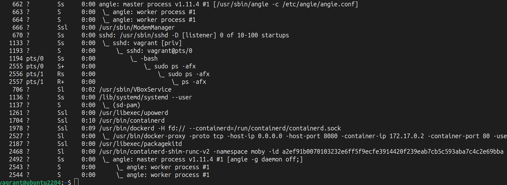
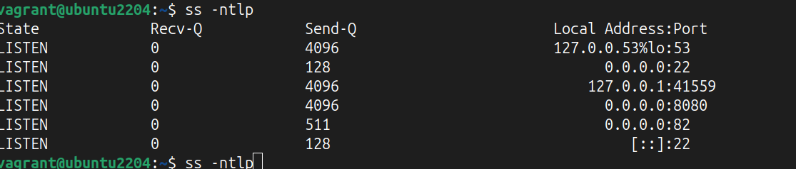
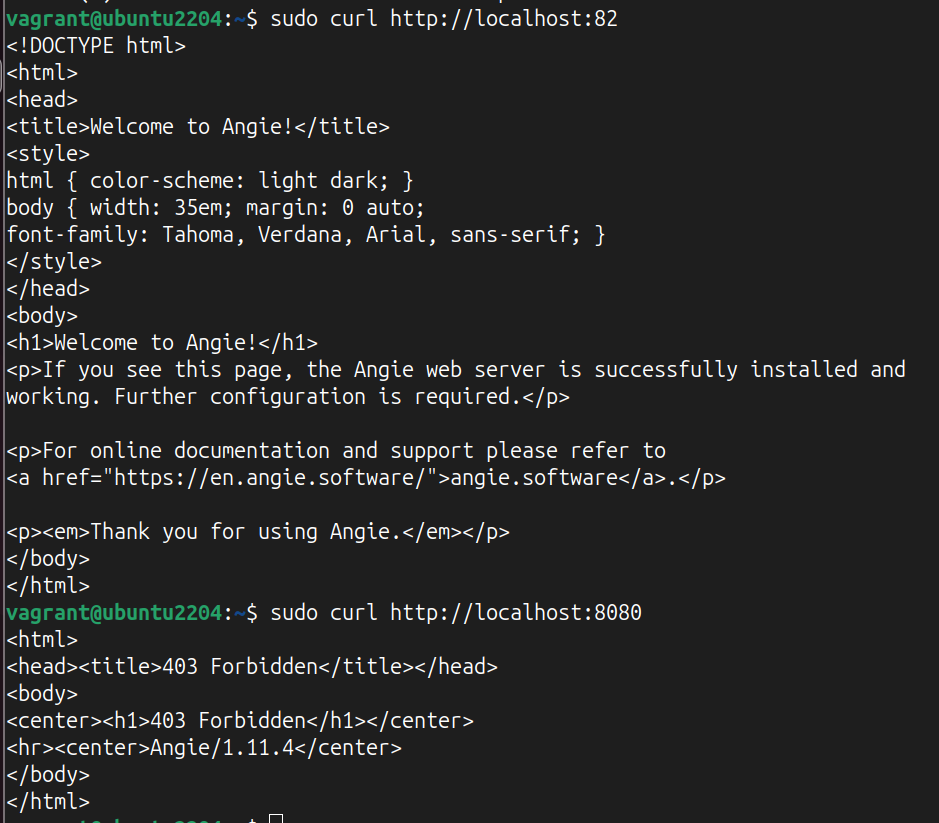

# Nginx/Angie
## Часть1. Установка Angie из пакетов
1. Установка пакета для работы с сертифкатами  
      *sudo apt-get update  
      sudo apt-get install -y ca-certificates curl* 
2. Получение открытого ключ репозитория Angie для проверки подлинности пакетов 
     *sudo curl -o /etc/apt/trusted.gpg.d/angie-signing.gpg \  
            https://angie.software/keys/angie-signing.gpg*  
3. Подключение репозитория  
    *echo "deb https://download.angie.software/angie/$(. /etc/os-release && echo "$ID/$VERSION_ID $VERSION_CODENAME") main" \ 
    | sudo tee /etc/apt/sources.list.d/angie.list > /dev/null*  
   *sudo apt-get update*  
4. Установка Angie и дополнительного модуля brotli  
   *sudo apt install angie angie-module-brotli*  

-------------------------------------------------------------------------------------------------------------------------------
## Brotli 
  ngx_brotli_filter — используется для сжатия ответов на лету. 
  ngx_brotli_static — используется для обработки предварительно сжатых файлов. 
**Подключение модуля к Angie в config** 
Подключение модулей в контексте main{}: 
  + load_module modules/ngx_http_brotli_filter_module.so; 
  + load_module modules/ngx_http_brotli_static_module.so;  \
 
_______________________________________________________________________________________________________________________________
Проверка работы Angie \
+ ps -afx
 
+ sudo systemctl status angie.service \
+   
_______________________________________________________________________________________________________________________________
## Часть2. Запуск Angie через Docker
1. Установка  docker
   *apt install docker.io*

2. Загрузка образа docker и создание контейнера
*docker run --rm --name angie -v /var/www:/usr/share/angie/html:ro -p **8080:80** -d docker.angie.software/angie:1.11.4-ubuntu*
  
3. Просмотр занятых портов  angie (port 82) и docker (8080)
   *ss -ntpl*
  
4. Проверить работу Angie на порту 82 и 80880
*curl http://localhost:82*
*curl http://localhost:8080*
  
5. Скопировать конфигурационные файлы из докер на хостовую машину. Присоединить полученную папку к контейнеру 
   *sudo docker cp angie:/etc/angie/ /home/vagrant/angie*
   *sudo docker run --name ang_vol -v /var/www:/usr/share/angie/html:ro -v /home/vagrant/angie:/etc/angie:ro --network host -d docker.angie.software/angie:1.11.4-ubuntu*
6. Узнать какая команда использовалась для создания контейнера
   
   

