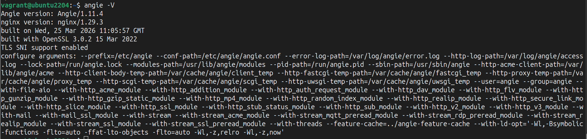

# Миграция с nginx на Angie #
______________________________________________________________________________________________
## 1. Для пакетов
* Собрать информацию об установленном Angie:
  - о версии пакета
  - о местоположении конфигов
  - о подключенных модулях  
**angie -V**  
 
