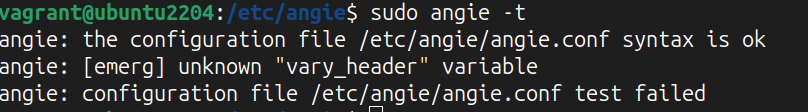
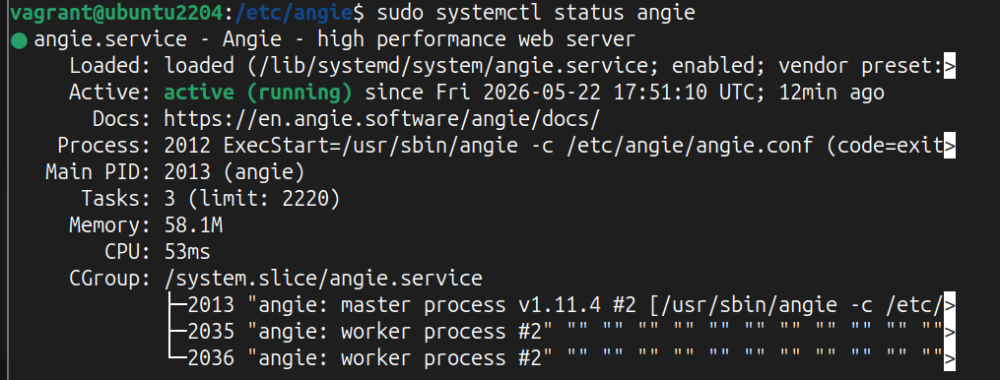

# Миграция с nginx на Angie #
______________________________________________________________________________________________
## 1. Для пакетов
* Собрать информацию об установленном Angie:
  - о версии пакета
  - о местоположении конфигов
  - о подключенных модулях  
**angie -V**  
  
* Скопировать конфиги nginx в папку /etc/angie, кроме nginx.conf  
  В данной работе скопированы папки sites-available, sites-enabled, snipets,static-avif.conf. 
* Из конфига nginx перенести данные: 
  - Пользователь: user www-data; 
  - Перенос настроек proxy в директиве http 
  - Перенос настроек gzip 
  - Перенос настроек brotly, ранее был установлен и вкючен в конфиге angie 
  - Переносится include в http модуле. Подключение директории /etc/angie/sites-enabled/* 
  - Перенос настроек map
* Поиск в скопированных конфигах "nginx" и замена на angie 
  **grep -nr "nginx"** 
   - Для одного файла: **sed -i 's|nginx|angie|g' snippets/fastcgi-php.conf**  
  - Для всех файлов где встречается "nginx": **find . -type f -name '*' exec sed -i 's|/nginx|/angie|g' {} \;** 
 
*Изменить путь в символических ссылках, замена nginx на angie 
*/sudo find . -type l -name "default" -exec sh -c '  
  for f; do  
    old=$(readlink "$f")  
    new=$(echo "$old" | sed "s|/nginx|/angie|g")  
#n-блокирует разыменование, f -удаление старой ссылки, s - создание новой ссылки 
    ln -sfn "$new" "$f"  
  done  
' _ {} + /*  

* Проверка конфигурации 
  **angie -t** 
Столкнулась с ошибкой: */ angie: [emerg] unknown "vary_header" variable 
                        angie: configuration file /etc/angie/angie.conf test failed/*  
                         
  Решение: 
  Найти в каком файле есть такое сочетание "vary_header"  
  **sudo find /etc/angie -type f -name "*.conf" -exec grep -l "vary_header" {} + ** 
  В результате выполнения найден скопированный файл nginx static-avif.conf. 
 static-avif.conf - для настройки обработки запросов к изображениям в форматах AVIF и WebP. 
  Ошибка связа с тем, что не был перенесен с конфига nginx в angie.conf блок настроек **map** 
  при этом был перенесен файл static-avif.conf. 
  
  
* Сравнить файлы mem.types, добавить изменения в файл angie 
* Проверить права для файлов 
* Проверка конфигурации 
  **angie -t** 
* Перечитать конфиги angie 
**sudo kill -HUP $(cat /run/angie.pid)** 

### Если есть в системе nginx!!! 
- Обязательно остановить nginx перед запуском angie 
  **sudo systemctl nginx stop && sudo systemctl angie start** 
- Проверить есть ли автозапуск у nginx. !!!! Отключить 
**sudo systemctl disable nginx** 
- Включить автозапуск у Angie 
**sudo angie enable** 

__________________________________________________________________________________________________________________
## Миграция с Docker
* Посмотреть контейнеры
  **docker ps**
pic!
* Посмотреть команду запуска контейнера. Важно помнить и сохранить команду запуска  
**docker run --rm -v /var/run/docker.sock:/var/run/docker.sock:ro assaflavie/runlike angie2** 
pic!
Или смотреть конфигурацию контейнера с помощью команды: 
**sudo docker inspect angie2** 
  В команде видно, что конфиги подключаются к контейнеру. Так как изменения уже были сделаны 
  в предыдущей части работы, то скопируем их в папку конфигов контейнера angie2 
  **sudo cp /etc/angie/angie.conf ~/angie/** 
  Так же изменить страничку nginx index.html из каталога http и 
  скопируем в путь /var/www/html 
  Изменим права для этой директории:
  **sudo chmod 755 -R /var/www/html**

В конфиге **~/angie/sites-available/default**
Изменим директорию сайта
*Запускаем контейнер
*Для просмотра этапа загрузки контейнера используется команда:
**sudo docker logs f1e4eb815d37**
  где набор цифр и букв - ID контейнера.
*Перечитаем конфиги angie для docker
**sudo docker kill -s HUP angie2**
*Проверяем работу angie в docker
**sudo curl http://localhost:80**
  

