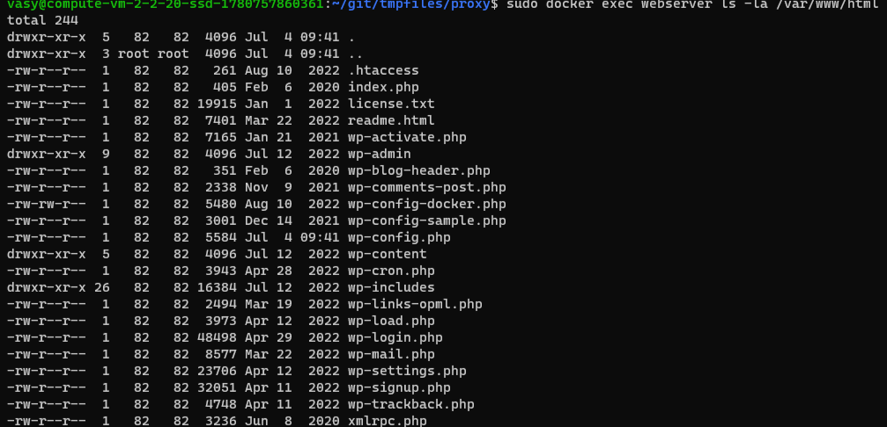
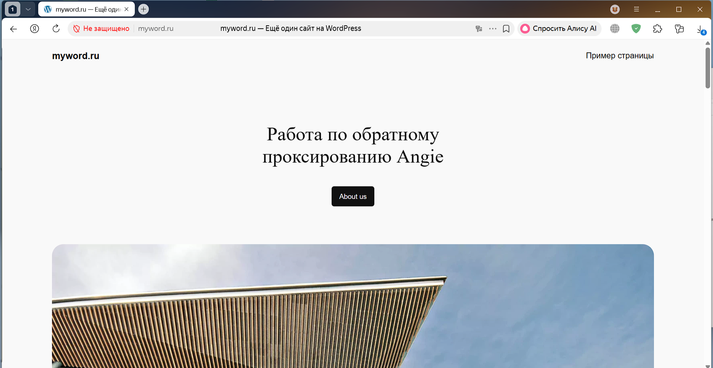
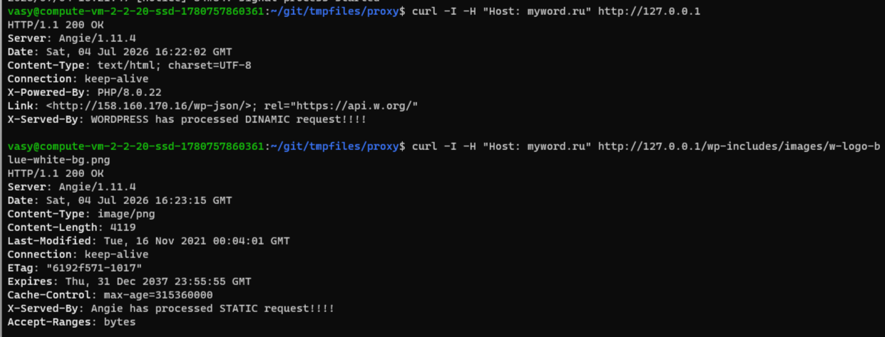

# Задание
Развернуть на виртуальной машине копию CMS WordPress или аналогичное веб-приложение </br>
с использованием стандартного дистрибутива или Docker-контейнера.</br>
Настроить Angie в качестве обратного прокси для бэкенда.</br>
Разделить обработку статических и динамических запросов.</br>
# Описание стенда
1. Виртуальная машина на облаке Yandex</br>
2. ОС ubuntu</br>
# Выполнение
1. Установить docker-compose</br>
   **sudo apt install docker-compose**
2. Для запуска докер образов Wordpress, Angie, MySql (нужна для работы WordPress)</br>
использовался файл [docker-compose.yml](./docker-compose.yml)</br>
Для webserver внесены изменения по volumes:</br>
```
   volumes:
      - wordpress:/var/www/html:ro
      - /home/vasy/angie/angie.conf:/etc/angie/angie.conf:ro
      - /home/vasy/angie/http.d:/etc/angie/http.d:ro
```
3. Сконфигурирован конфиг angie для сайта [angie/http.d/default.conf](./default.conf)</br>
   - Добавлено имя сайта: server_name  myword.ru www.myword.ru;</br>
   - Для статических картинок добавлен HEAD о том, что статику обрабатывает сам webserver Angie:</br>
   ```
         location ~* \.(?:jpeg|jpg|png|gif|svg)$ {
         expires max;
         log_not_found off;
         add_header X-Served-By "Angie has processed STATIC request!!!!" always;        
         } 
  - Для файлов, которые должен обрабатывать Wordpress (.php) добавлено обратное проксирование </br>
    с помощью протокола fastcgi:</br>
    ```
     location ~ \.php$ {
        try_files $uri =404;
        fastcgi_split_path_info ^(.+\.php)(/.+)$;
        fastcgi_pass wordpress:9000;
        fastcgi_index index.php;
        include fastcgi_params;
        fastcgi_param SCRIPT_FILENAME $document_root$fastcgi_script_name;
        fastcgi_param PATH_INFO $fastcgi_path_info;
        add_header X-Served-By "WORDPRESS has processed DINAMIC request!!!!" always;
     }
  - Добавлен заголовок, что Wordpress обработает запрос на исполнение php файла</br>
    ```
     add_header X-Served-By "WORDPRESS has processed DINAMIC request!!!!" always;</br>

  - Разделение запросов статики и динамики для корневой директории.</br>
  Если пользователь запрашивает конкретный путь, то Angie перенаправляет запрос на location для его обработки,</br>
  например, для обработки запроса на получение картинок,</br>
  если angie не находит запрашиваемый путь, то он перенаправляет запрос пользователя на исполняемый файл wordpress</br>
  index.php с сохранением (при наличии) параметров от пользователя.</br>
    ```
      location / {
        try_files $uri $uri/ /index.php$is_args$args;
      } 
4. Запускаем docker-compose</br>
**sudo docker-compose up -d**</br>
5. Проверим, что файлы wordpress находятся в root директории сайта</br>
**sudo docker exec webserver ls -la /var/www/html**</br>

6. Проверка работы сайта с хоста.</br>
Для этого на хосте необходимо внести изменение в файл [hosts](./hosts).</br>
Добавить соответствие ip адреса удаленной машины с именем сайта</br>
   ```
    158.160.170.16 myword.ru
    158.160.170.16 www.myword.ru

7. Проверка работы Angie как обратного прокси</br> 
(Перенаправление запросов от пользователя к приложению Wordpress и направление ответа от wordpress к пользователю)</br>
   ```
    curl -I -H "Host: myword.ru" http://127.0.0.1
    curl -I -H "Host: myword.ru" http://127.0.0.1/wp-includes/images/w-logo-blue-white-bg.png
   ```

