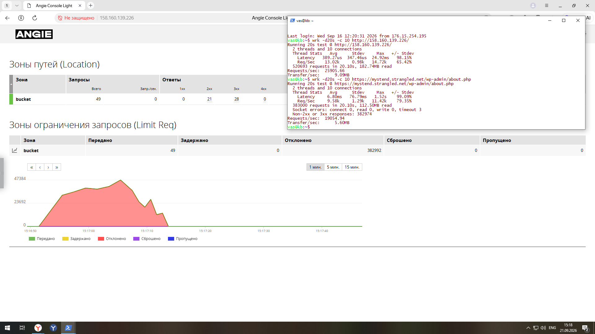
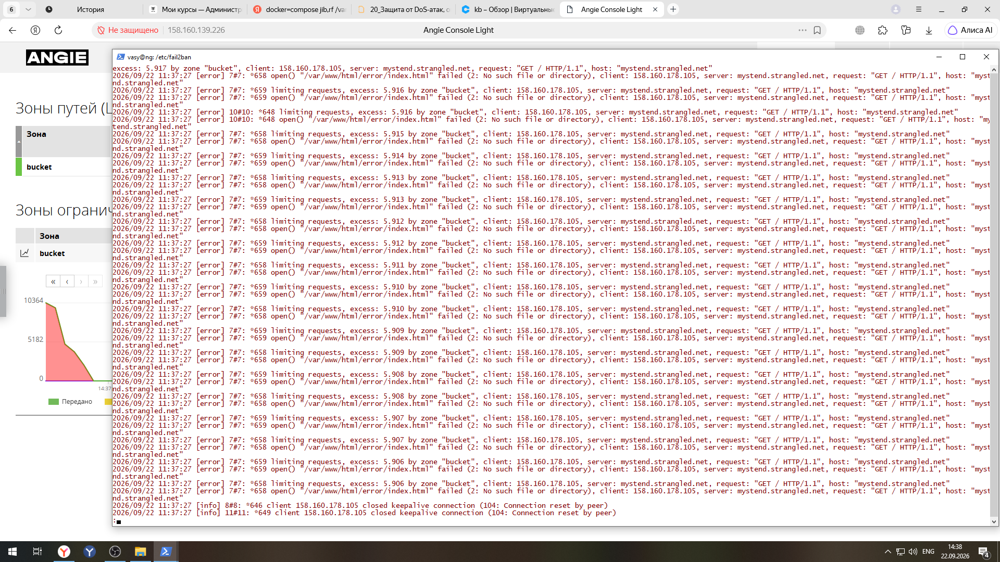
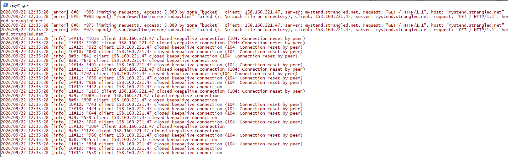
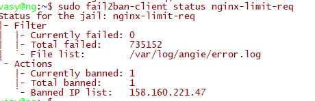
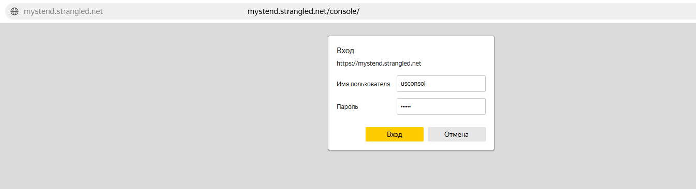
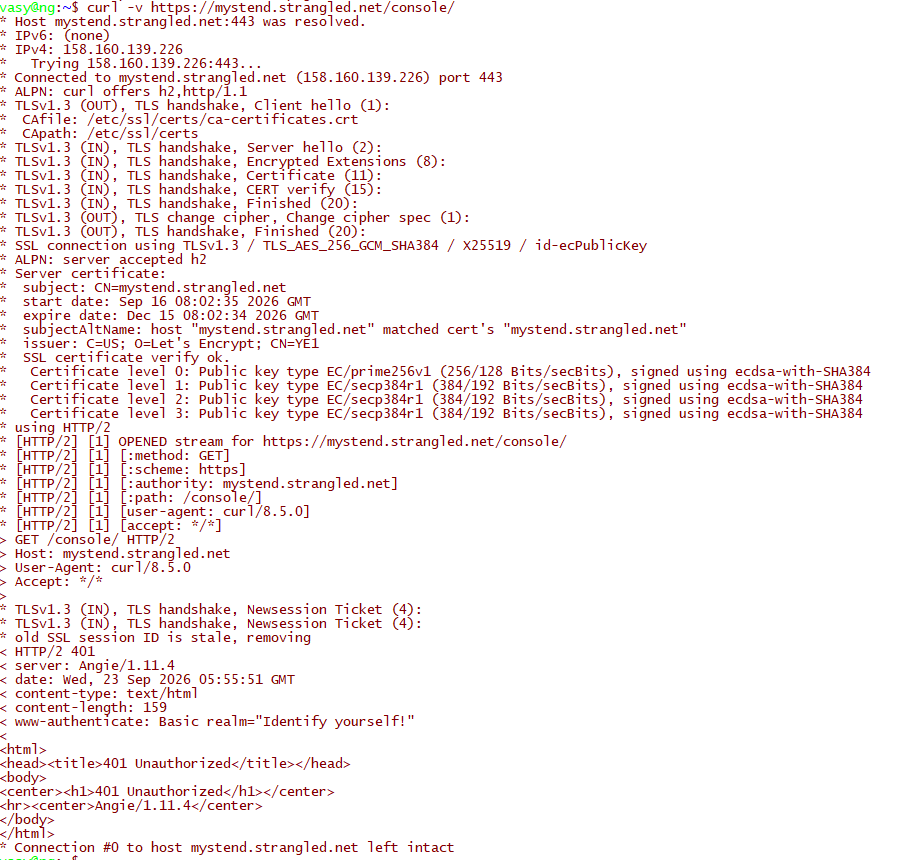

### Задание 1. Настроить ограничение частоты запросов.
### Задание 2. Запустить сервис fail2ban для автоматической блокировки атакующих на основе частоты запросов.
### Задание 3. Настроить авторизацию и ограничение доступа.
__________________________________________________________________________________________________________
## Задание 1. 
В качестве backend приложения используется WordPress. 
Ограничение частоты запросов настраивается для Location, обрабатывающий запросы на Wordpress. </br>
1. Определение зоны разделяемой памяти на уровне http ( [angie.conf](7.Dos_Attack/angie.conf) ):</br>
   **limit_req_zone $binary_remote_addr zone=bucket:10m rate=1r/s;** </br>
Директива создаёт правило ограничения частоты запросов:</br>
- В разделяемой памяти выделяется зона "bucket" размером 10 МБ.</br>
- Ключом группировки является IP-адрес клиента ($binary_remote_addr в бинарном виде).</br>
- В зоне для каждого уникального IP хранится его состояние: время последнего запроса и счётчик переполнения.</br>
- Задаётся лимит частоты — не более 1 запроса в секунду с одного IP-адреса.</br>
2. Включение зоны bucket и выполнение ограничение запросов для location ( [default.conf](7.Dos_Attack/default.conf) ) .</br>
```
   location ~ \.php$ {
     limit_req zone=bucket burst=5 nodelay;
        limit_req_log_level error;
        limit_req_status 503;
        status_zone bucket;
    }
```
Для ограничения запросов для location подключаем зону bucket, определённую ранее директивой limit_req_zone в контексте http.</br>
  * Задаём очередь сверх лимита ( *burst=5* ). Параметр burst=5 разрешает буферизацию до 5 запросов сверх базового лимита (1 r/s). </br>
  * Указываем, что запросы из burst-очереди обрабатываются немедленно, без искусственной задержки ( *nodelay* ).</br>
  * Отклоненные запросы будут записаны в error.log с уровнем error ( *limit_req_log_level error* ).</br>
  * Запросы отклоняются с ошибкой "503" ( *limit_req_status 503* ).</br>
  * Включается мониторинг зоны bucket ( *status_zone bucket*).</br>

 </br>
ЛОГ Ошибок
 </br>
_____________________________________________________________________________________________________________________________________________ </br>
## Задание 2.
Утилита **fail2ban** позволяет блокировать запросы с IP адреса на уровне сетевого экрана (iptables/nftables) на заданное время на основе анализа лог-файлов по заданным шаблонам.</br>
1. Устанавливаем утилиту **fail2ban**</br>
   sudo apt install fail2ban</br>
2. Копируем файл **/etc/fail2ban/jail.conf** в **/etc/fail2ban/jail.local**</br>
   cp /etc/fail2ban/jail.conf /etc/fail2ban/jail.local</br>
3. Настроим fail2ban на блокирование ip адреса при превышении ограничения запросов ( [jail.local](7.Dos_Attack/jail.local)):</br>
```
   [nginx-limit-req]
  port    = http,https
  enabled = false
  filter = nginx-limit-reg
  action = iptables-multiport[name=ReqLimit, port="http,https", protocol=tcp]
  logpath = /var/log/angie/*error.log
  findtime = 600
  bantime = 7200
  maxretry = 4
```
 </br>
 </br>
__________________________________________________________________________________________________________________________________________________</br>
## Задание 3.

Настроим авторизацию для консоли angie [default.conf](7.Dos_Attack/default.conf).</br>
```
  #Настройка Angie Console Light#
    location /console/ {
     alias /usr/share/angie-console-light/html/;
    index index.html;
    api_config_files on;
#Настройки аутентификации для консоли
    satisfy any;
    allow 10.249.69.180;
    deny all;
    auth_basic "Identify yourself!";
    auth_basic_user_file /etc/angie/ht.pass;
    location /console/api/ {
        api /status/;     
      }
    }
```
Создадим пользователя и пароль с помощью утилиты htpasswd:</br>
    sudo htpasswd -c /etc/angie/htpasswd usconsol</br>
</br>
</br>
    
 
